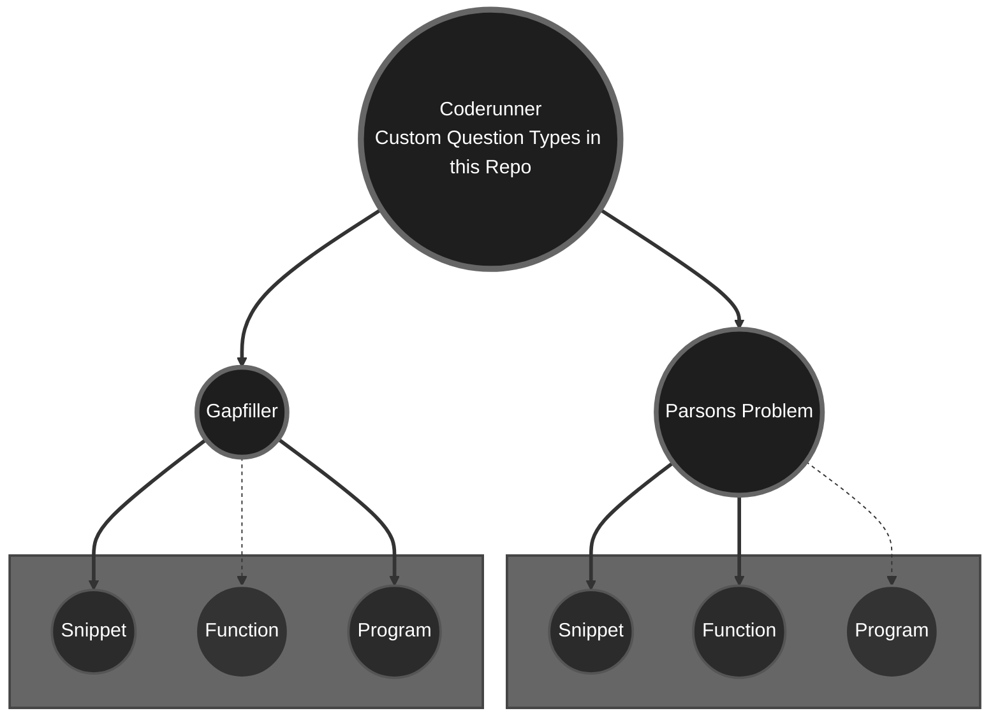

# Coderunner-C-Prototypes
Specialized prototypes, examples, and documentation for custom C programming tasks in the Moodle Coderunner plugin.

## Introduction

Programming exercises play a crucial role in computer science education, offering students practical opportunities to apply theoretical concepts.
While the Moodle Coderunner plugin supports a wide range of question types, it does not natively accommodate Parsons Problems or Fill-the-Gaps tasks for the C programming language.

However, by developing and implementing custom prototypes, it is possible to integrate these exercise formats effectively.
This repository provides two prototypes for Parsons Problems (Snippet and Function) and two prototypes for Fill-the-Gaps tasks (Snippet and Program), specifically tailored for use with Coderunner in C.

