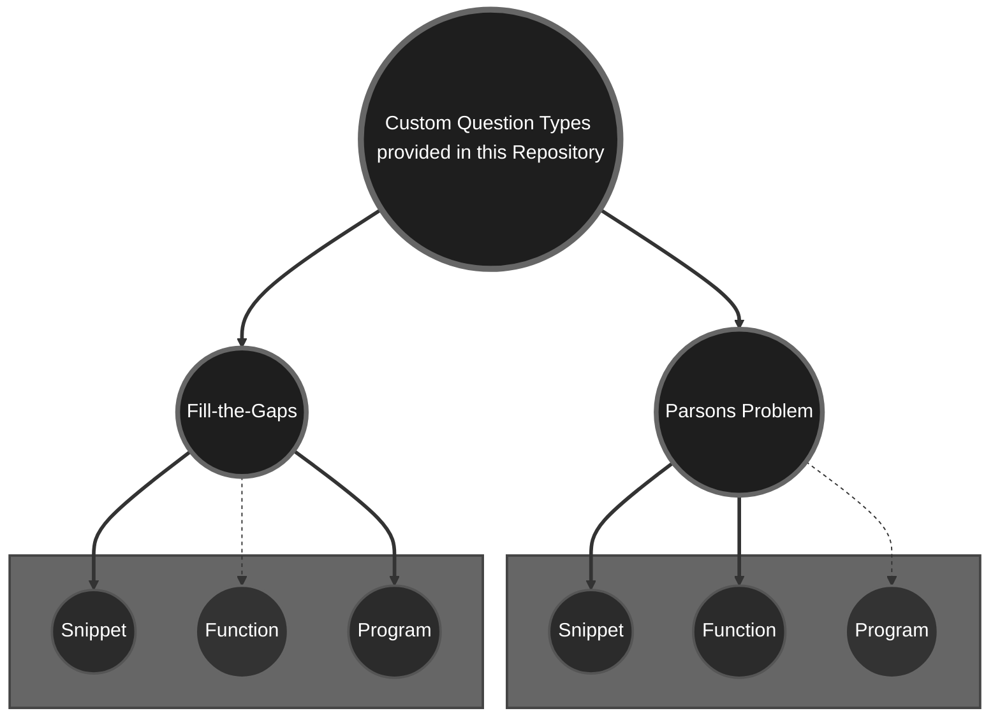
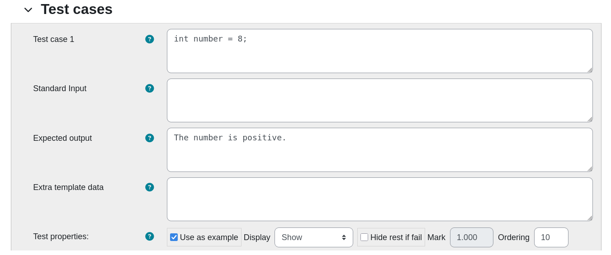
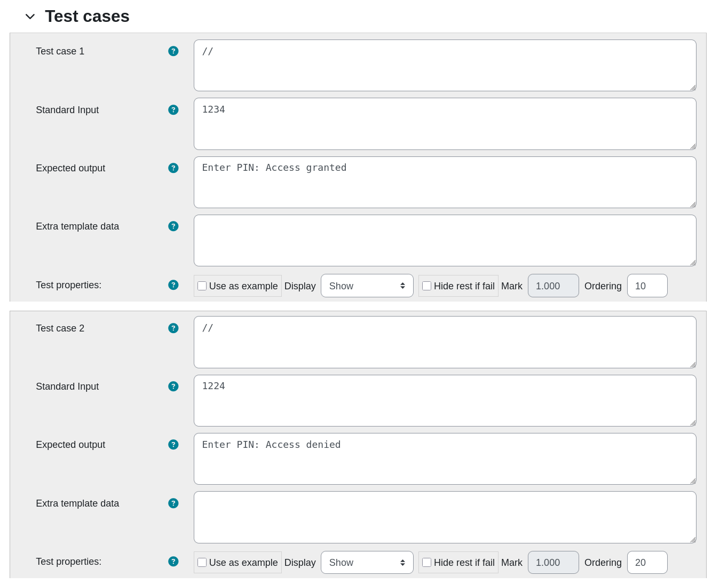
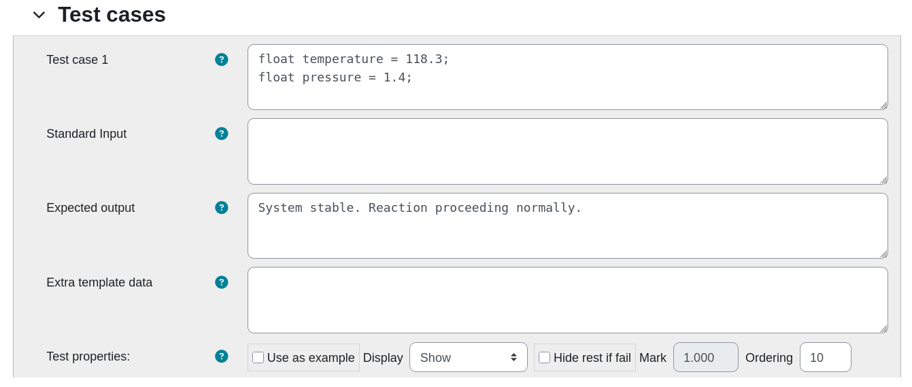
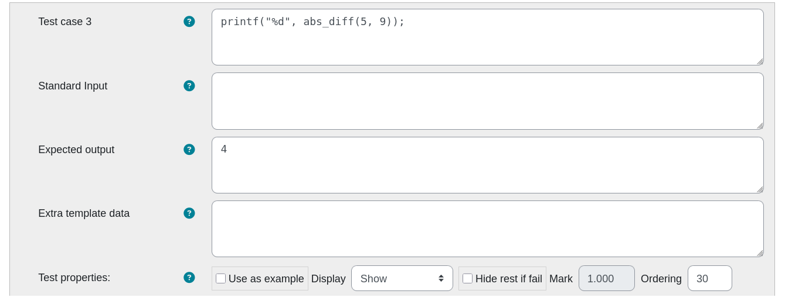

# Coderunner-C-Prototypes
Specialized prototypes, examples, and documentation for custom C programming tasks in the Moodle Coderunner plugin.


## Introduction

Programming exercises play a crucial role in computer science education, offering students practical opportunities
to apply theoretical concepts. While the Moodle Coderunner plugin supports a wide range of question types 
(including Parsons Problem and Fill-the-Gaps tasks for **Python**), it does
not natively accommodate Parsons Problems or Fill-the-Gaps tasks for the **C programming language**. 


However, by developing and implementing custom prototypes, it is possible to integrate these exercise
formats effectively. This repository provides two prototypes for Parsons Problems
and two prototypes for Fill-the-Gaps tasks, specifically tailored 
for use with Coderunner in C.

## Structure of the Repository

The structure of this repository is as follows:

```
Coderunner-C-Prototypes/
├── prototypes/          # C code prototypes
├── example_questions/   # Example questions based on the Prototypes provided here
├── images/              # Images used in README
└── README.md            # Project documentation
```

## Why two prototypes for each question type?

The structure and evaluation of C programming tasks vary significantly depending on the level of code students are expected to produce.
As illustrated in the diagram below, different prototypes are necessary for handling:

- **Code snippets**, which focus on small isolated code fragments such as conditional statements or loops,
- **Standalone functions**, where a complete function with input parameters and return values must be implemented,
- **Complete programs**, including the `main()` function and full input/output management.

Ideally, each exercise format — Parsons Problems and Fill-the-Gaps — would require three distinct prototypes to fully 
cover these different structures. However, at present, this repository provides two prototypes for each type, 
covering code snippets and functions (Parsons Problem) and snippets and complete programs (Fill-the-Gaps).

Each of these developed prototypes has its own template logic adapted to the structure of the expected student submissions. For example, evaluating a snippet involves inserting the student's code several times into a controlled 
template and testing specific outputs. In contrast, testing a full program requires running an independently executable source file, while functions must be validated based on their defined interface and behaviour.

The solid lines in the diagram represent prototypes already developed and available in this repository. Dashed lines indicate
intended future prototypes that have not yet been implemented.




## Set Up Process

To integrate the provided prototypes into your Moodle system:

1. Download the XML files located in `./prototypes/`.
   Each XML file contains the complete configuration for a specific custom prototype.

2. Log in to Moodle in a teacher role with site administration rights, enable edit mode, and navigate to the Coderunner Question Bank. (To do so, open an existing Coderunner Quiz and select the 'Question Bank' tab.)

3. Select the category where your built-in prototypes are stored in (`SYSTEM` -> `CR_PROTOTYPES` or similar)

   ⚠️ Note: This step usually requires site administrator rights. Otherwise you will not see the `SYSTEM` tab.

4. Select `Import` in the upper left corner dropdown menu (default: `Questions`) and upload the XML-Files.

5. Go back to `Questions` in the dropdown menu in the upper left corner and check if the new prototype is available in the Prototypes-Category. If so, it will then be available when creating new CodeRunner questions.


## Documentation of each Prototype

### Fill-The-Gaps

#### General

A Fill-the-Gaps question requires students to complete missing parts of a given code fragment. Instead of writing code from
scratch, learners are presented with a partially completed program where specific sections are left blank for them to fill in. To initialize such a question, you need to create a new Coderunner question and select the prototype `c_gapfiller_snippet` or `c_gapfiller_programm`

Technically, Fill-the-Gaps tasks in Coderunner use placeholders in the `Global extra` field of the question definition. These
placeholders are replaced at runtime by HTML input or textarea elements, into which the students enter their missing code
fragments.

The syntax for these placeholders is as follows:

- `{[ 20 ]}` inserts an HTML text input field with a width of 20 characters.
- `{[ 10, 5 ]}` inserts an HTML textarea with 10 columns and 5 rows.

Once students submit their answer, the entered values are reinserted into the original template, replacing the placeholders.
The resulting completed program is then compiled and executed according to the grading logic defined in the snippet, function,
or program template.


> ⚠️ **Warning:**  
> Due to the parsing logic used in the current templates, quotation marks (`"`) are not allowed inside Fill-the-Gaps inputs.
> 
> When defining tasks, tutors should ensure that no gap requires students to enter quotation marks.
> Internally, the student's responses are inserted into the C template by manually processing a JSON structure using `replace` functions within Twig.
> Quotation marks would interfere with this parsing process and cause invalid code generation.


For example, an incomplete program might be defined as follows:

```c
#include <stdio.h>

int main() {
    int a = 5, b = 3;
    printf("Sum: {[ 5 ]}\n");
    return 0;
}
```


#### Snippet

In Fill-the-Gaps exercises designed for code snippets, the student's completed code is inserted multiple times into a controlled C program template, once for each defined test case.

Each insertion occurs within a separate block where a specific test input is provided, and the output is captured for comparison against the expected result. A designated separator string (e.g., `"#<ab@17943918#@>#"` in this example) is printed between test cases to ensure that outputs can be cleanly parsed and matched during grading.

For example, the following incomplete code snippet might be presented to the student:

```c
if (number {[1, 5 ]}) {
    printf("The number is positive.\n");
} {[1, 10 ]} (number {[1, 5 ]}) {
    printf("The number is negative.");
} else {
    printf("The number is zero.");
};
```

The student's filled-in solution is then embedded multiple times into a full C program template, like so:

```c
#include <stdio.h>
#include <stdlib.h>

#define SEPARATOR "#<ab@17943918#@>#"

int main() {
    {
        // Test code:
        int number = 8;
        // Student code:
        if (number > 0) {
            printf("The number is positive.\n");
        } else if (number < 0) {
            printf("The number is negative.");
        } else {
            printf("The number is zero.");
        };
        printf("%s\n", SEPARATOR);
    }
    {
        // Test code:
        int number = -9;
        // Student code:
        if (number > 0) {
            printf("The number is positive.\n");
        } else if (number < 0) {
            printf("The number is negative.");
        } else {
            printf("The number is zero.");
        };
        printf("%s\n", SEPARATOR);
    }
    {
        // Test code:
        int number = 0;
        // Student code:
        if (number > 0) {
            printf("The number is positive.\n");
        } else if (number < 0) {
            printf("The number is negative.");
        } else {
            printf("The number is zero.");
        };
    }
    return 0;
}
```

Each block independently evaluates a specific input (`number = 8`, `number = -9`, `number = 0`) and compares the program's output to the expected answer.

This structure allows multiple test cases to be evaluated efficiently within a single compilation and execution cycle, while maintaining clarity and separation of outputs for automated grading.

To configure the corresponding test cases in Moodle Coderunner, the test definition must match the structure of the template. Each test case specifies the preconditions for the snippet execution, typically by setting up the necessary input variables. An example configuration for the first test case, corresponding to number = 8, is shown below:




#### Program

In Fill-the-Gaps exercises designed for complete programs, the student's completed code is inserted into a full C program template, which is then compiled and executed for each test case separately.

Unlike the snippet-based approach, the program is not duplicated within a single source file for multiple tests. Instead, the program is compiled once and executed multiple times, each time providing different standard input values through `scanf` or similar mechanisms.

For example, the following incomplete program might be presented to the student. Background: In this exercise, students are tasked with completing a C program that simulates access control to a laboratory. Only users who enter the correct PIN code (1234) are allowed to gain access.

```c
#include <stdio.h>

int main() {
    int pin;
    
    printf("Enter PIN: ");
    scanf("%d", &pin);
    
    {[1, 18]}
        printf("{[1, 20]}\n");
    }
    {[1, 18]}
        printf("{[1, 20]}\n");
    }
    
    return 0;
}
```

The student's completed solution is inserted into this template and compiled into a full program, such as:

```c
#include <stdio.h>

int main() {
    int pin;
    
    printf("Enter PIN: ");
    scanf("%d", &pin);
    
    if(pin == 1234) {
        printf("Access granted\n");
    }
    else { 
        printf("Access denied\n");
    }
    
    return 0;
}
```

Each test case provides a different standard input value (for example, `1234` or `1224`) to simulate different scenarios.
The student's completed program reads the input at runtime using `scanf`, processes it, and produces the corresponding output.

The configuration of the test cases in Moodle Coderunner must reflect this structure. An example configuration is shown below:



In this setup:
- **Test case**: left empty (`//`) as no pre-execution setup is needed.
- **Standard Input**: Provides the input that will be fed into the program at runtime (e.g., `1234` or `1224`).
- **Expected Output**: Defines the output the program must produce based on the given input (e.g., `Enter PIN: Access granted`).
- **Extra template data**: Remains empty for standard Fill-the-Gaps program exercises.

### Parsons Problem

#### General

A Parsons Problem is a type of programming exercise where students are given a set of code lines in a scrambled order. Their
task is to arrange the lines correctly to form a logically valid and syntactically correct program. Parsons Problems promote
deeper understanding of code structure, logical flow, and syntax without requiring students to memorize every detail of the language.

To create Parsons Problems in Moodle Coderunner for C programming, the following general steps must be followed:

1. Create a new Question and choose the prototype `c_ParsonsProblem_programm` or `c_ParsonsProblem_function`.
2. Open the **Answer preload** section.
3. Paste the correct, fully functional code into both the **Answer preload** and the **Answer** fields.
4. Optionally add further **distractor lines** to the **Answer preload** (these are misleading or unnecessary lines intended to increase difficulty).
5. Use the **Unindent** and **Shuffle** buttons in the **Answer preload** field to remove proper indentation and randomize the line order.
6. Save the question configuration.


#### Snippet

In Parsons Problem exercises designed for code snippets, students are presented with shuffled lines of a small program **fragment**. For example, students might be given the following shuffled lines in the Moodle Coderunner interface. In this exercise, students must rearrange a shuffled C code snippet that checks whether temperature and pressure values are within safe operating ranges.

```text
int pressure_ok = (pressure >= 1.0 && pressure <= 2.5);
} else if (temp_ok || pressure_ok) {
if (temp_ok && pressure_ok) {
printf("Instability detected. Cooling systems activated.");
printf("CRITICAL CONDITION! Emergency shutdown initiated!");
int temp_ok = (temperature >= 100.0 && temperature <= 200.0);
printf("System stable. Reaction proceeding normally.");
}
} else {
```

The student's goal is to reconstruct the correct code snippet, which might look like:

```c
int temp_ok = (temperature >= 100.0 && temperature <= 200.0);
int pressure_ok = (pressure >= 1.0 && pressure <= 2.5);
if (temp_ok && pressure_ok) {
    printf("System stable. Reaction proceeding normally.");
} else if (temp_ok || pressure_ok) {
    printf("Instability detected. Cooling systems activated.");
} else {
    printf("CRITICAL CONDITION! Emergency shutdown initiated!");
}
```

This solution is then inserted into the testing template, which compiles and runs the student's code fragment against several predefined test cases. 
The template-generated program corresponding to the example above would look like this:

```c
#include <stdio.h>
#include <stdlib.h>
#include <ctype.h>
#include <string.h>
#include <stdbool.h>
#include <math.h>

#define SEPARATOR "#<ab@17943918#@>#"

int main() {
    {
        // Test code:
        float temperature = 118.3;
        float pressure = 1.4;
        // Student code:
        int temp_ok = (temperature >= 100.0 && temperature <= 200.0);
        int pressure_ok = (pressure >= 1.0 && pressure <= 2.5);
        if (temp_ok && pressure_ok) {
            printf("System stable. Reaction proceeding normally.");
        } else if (temp_ok || pressure_ok) {
            printf("Instability detected. Cooling systems activated.");
        } else {
            printf("CRITICAL CONDITION! Emergency shutdown initiated!");
        }
    }
    printf("%s\n", SEPARATOR);
    {
        // Test code:
        float temperature = 5.3;
        float pressure = 1.4;
        // Student code:
        int temp_ok = (temperature >= 100.0 && temperature <= 200.0);
        int pressure_ok = (pressure >= 1.0 && pressure <= 2.5);
        if (temp_ok && pressure_ok) {
            printf("System stable. Reaction proceeding normally.");
        } else if (temp_ok || pressure_ok) {
            printf("Instability detected. Cooling systems activated.");
        } else {
            printf("CRITICAL CONDITION! Emergency shutdown initiated!");
        }
    }
    printf("%s\n", SEPARATOR);
    {
        // Test code:
        float temperature = 118.3;
        float pressure = 0.4;
        // Student code:
        int temp_ok = (temperature >= 100.0 && temperature <= 200.0);
        int pressure_ok = (pressure >= 1.0 && pressure <= 2.5);
        if (temp_ok && pressure_ok) {
            printf("System stable. Reaction proceeding normally.");
        } else if (temp_ok || pressure_ok) {
            printf("Instability detected. Cooling systems activated.");
        } else {
            printf("CRITICAL CONDITION! Emergency shutdown initiated!");
        }
    }
    printf("%s\n", SEPARATOR);
    {
        // Test code:
        float temperature = 7.3;
        float pressure = 0.4;
        // Student code:
        int temp_ok = (temperature >= 100.0 && temperature <= 200.0);
        int pressure_ok = (pressure >= 1.0 && pressure <= 2.5);
        if (temp_ok && pressure_ok) {
            printf("System stable. Reaction proceeding normally.");
        } else if (temp_ok || pressure_ok) {
            printf("Instability detected. Cooling systems activated.");
        } else {
            printf("CRITICAL CONDITION! Emergency shutdown initiated!");
        }
    }
    return 0;
}
```

Each block tests the reconstructed code under different input conditions, verifying the program's correctness.

The test cases in Moodle are configured accordingly. An example test setup for the first condition (`temperature = 118.3; pressure = 1.4;`) is shown below:



In this setup:
- **Test case**: Sets up the input variables (`float temperature = 118.3; float pressure = 1.4;`).
- **Standard Input**: Remains empty if you have no `scanf()` calls or similair.
- **Expected Output**: Matches the program's expected printed result for the provided conditions.


#### Function

In Parsons Problem exercises designed for standalone functions, students are given scrambled lines that define an entire function, including control structures like `if` statements or loops.
Their task is to reorder the lines and reconstruct a correct and logically functioning implementation.

For example, students might be given the following shuffled lines in the Moodle Coderunner interface. Background: In this exercise, students are tasked with correctly reordering scrambled lines to reconstruct a complete function that calculates the absolute difference between two integers.

```text
}
} else {
return b - a;
int abs_diff(int a, int b) {
}
return a - b;
if (a > b) {
```

The correct reconstruction would produce the following function:

```c
int abs_diff(int a, int b) {
    if (a > b) {
        return a - b;
    } else {
        return b - a;
    }
}
```

This solution is then inserted into the testing template, which compiles and runs the student's reconstructed function against a series of predefined test cases. The template-generated program would look like this:

```c
#include <stdio.h>
#include <stdlib.h>
#include <ctype.h>
#include <string.h>
#include <stdbool.h>
#include <math.h>

#define SEPARATOR "#<ab@17943918#@>#"

// Student code:
int abs_diff(int a, int b) {
    if (a > b) {
        return a - b;
    } else {
        return b - a;
    }
}

int main() {
    {
        printf("%d", abs_diff(-100, -97));
    }
    printf("%s\n", SEPARATOR);
    {
        printf("%d", abs_diff(-1, 9));
    }
    printf("%s\n", SEPARATOR);
    {
        printf("%d", abs_diff(5, 9));
    }
    printf("%s\n", SEPARATOR);
    {
        printf("%d", abs_diff(5, 5));
    }
    return 0;
}
```

Each block tests the student's function implementation with different input values and checks if the function produces the correct output.

The test cases in Moodle must be configured accordingly. An example configuration for the test case where `abs_diff(5, 9)` is called is shown below:



In this setup:
- **Test case**: Specifies the code to invoke the student's function (`printf("%d", abs_diff(5, 9));`).
- **Standard Input**: Remains empty.
- **Expected Output**: Defines the expected return value printed to the console (`4` in this case).
- **Extra template data**: Usually not required.

This structure allows targeted evaluation of students' ability to reconstruct functional logic, focusing on function signatures, control flow, and return values.

## Acknowledgements

This repository builds upon the outstanding work of the Moodle **CodeRunner** plugin, developed and maintained by **Richard Lobb** and other contributors. The CodeRunner project provides the foundational infrastructure that makes the creation of custom programming exercises possible within the Moodle environment.

The original CodeRunner source code is licensed under the [GNU General Public License v2.0](https://www.gnu.org/licenses/old-licenses/gpl-2.0.en.html) (GPL-2.0). The CodeRunner plugin repository is available at [github.com/trampgeek/moodle-qtype_coderunner](https://github.com/trampgeek/moodle-qtype_coderunner). 

Since the Prototypes located in `./prototypes/` are derivatives of the Prototypes published on [coderunner.org.nz](https://coderunner.org.nz/), all additions provided in this repository are derivative works based on the original CodeRunner framework and are therefore distributed under the same GPL-2.0 license.

Special thanks to Richard Lobb and the CodeRunner community for providing a robust and flexible foundation for developing custom question types in computer science education.

