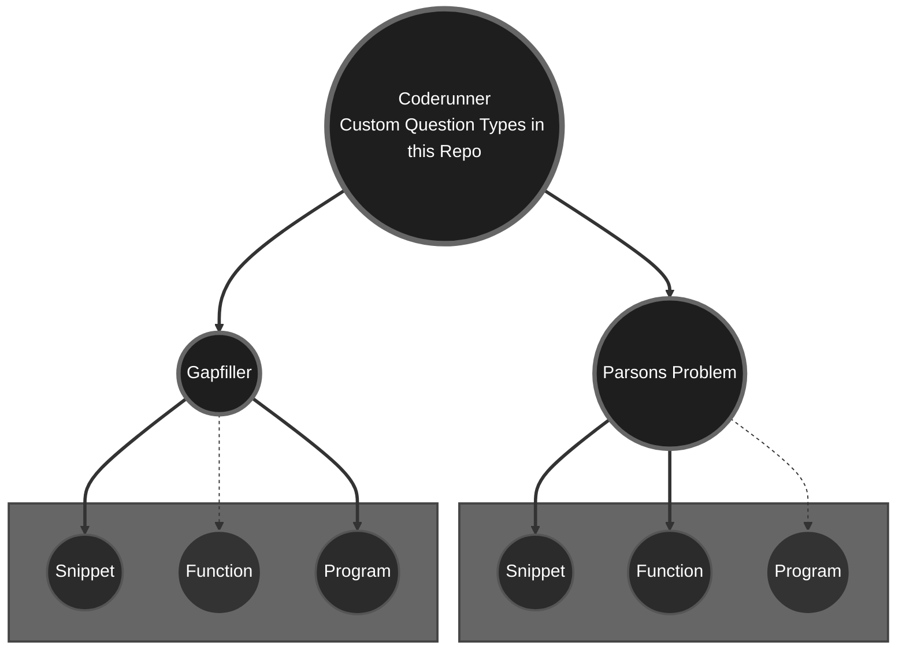

# Coderunner-C-Prototypes
Specialized prototypes, examples, and documentation for custom C programming tasks in the Moodle Coderunner plugin.

## Introduction

Programming exercises play a crucial role in computer science education, offering students practical opportunities
to apply theoretical concepts. While the Moodle Coderunner plugin supports a wide range of question types 
(including Parsons Problem and Fill-the-Gaps tasks for **Python**), it does
not natively accommodate Parsons Problems or Fill-the-Gaps tasks for the **C programming language**. 

However, by developing and implementing custom prototypes, it is possible to integrate these exercise
formats effectively. This repository provides two prototypes for Parsons Problems
and two prototypes for Fill-the-Gaps tasks, specifically tailored 
for use with Coderunner in C.

## Why two prototypes for each question type?

The structure and evaluation of C programming tasks vary significantly depending on the level of code students are expected to produce.  
As illustrated in the diagram above, different prototypes are necessary for handling:

- **Code snippets**, which focus on small isolated code fragments such as conditional statements or loops,
- **Standalone functions**, where a complete function with input parameters and return values must be implemented,
- **Complete programs**, including the `main()` function and full input/output management.

Ideally, each exercise format — Parsons Problems and Fill-the-Gaps — would require three distinct prototypes to fully cover these different structures.  
However, at present, this repository provides two prototypes for each type, covering code snippets and functions (Parsons Problem) and snippets and complete programs (Fill-the-Gaps).  

Each of these developed prototypes has its own template and grading logic adapted to the structure of the expected student submissions.  
For example, evaluating a snippet typically involves inserting the student's code into a controlled template and testing specific outputs.  
In contrast, testing a full program requires compiling and running an independently executable source file, while functions must be validated based on their defined interface and behaviour.

The solid lines in the diagram represent prototypes already developed and available in this repository.  
Dashed lines indicate intended future prototypes that have not yet been implemented.  
They highlight potential extensions, particularly for Parsons Problems involving complete programs and for Fill-the-Gaps tasks requiring standalone functions, where additional complexity in evaluation would need to be addressed.

