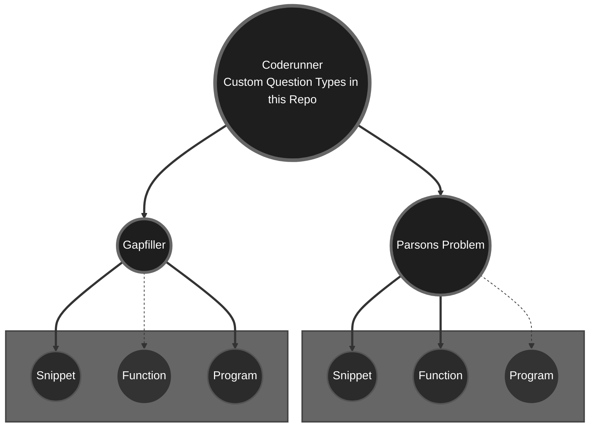

# Coderunner-C-Prototypes
Specialized prototypes, examples, and documentation for custom C programming tasks in the Moodle Coderunner plugin.

## Introduction

Programming exercises play a crucial role in computer science education, offering students practical opportunities
to apply theoretical concepts. While the Moodle Coderunner plugin supports a wide range of question types 
(including Parsons Problem and Fill-the-Gaps tasks for **Python**), it does
not natively accommodate Parsons Problems or Fill-the-Gaps tasks for the **C programming language**. 


However, by developing and implementing custom prototypes, it is possible to integrate these exercise
formats effectively. This repository provides two prototypes for Parsons Problems
and two prototypes for Fill-the-Gaps tasks, specifically tailored 
for use with Coderunner in C.

## Why two prototypes for each question type?

The structure and evaluation of C programming tasks vary significantly depending on the level of code students are expected to produce.
As illustrated in the diagram below, different prototypes are necessary for handling:

- **Code snippets**, which focus on small isolated code fragments such as conditional statements or loops,
- **Standalone functions**, where a complete function with input parameters and return values must be implemented,
- **Complete programs**, including the `main()` function and full input/output management.

Ideally, each exercise format — Parsons Problems and Fill-the-Gaps — would require three distinct prototypes to fully 
cover these different structures. However, at present, this repository provides two prototypes for each type, 
covering code snippets and functions (Parsons Problem) and snippets and complete programs (Fill-the-Gaps).

Each of these developed prototypes has its own template logic adapted to the structure of the expected student submissions. For example, evaluating a snippet involves inserting the student's code several times into a controlled 
template and testing specific outputs. In contrast, testing a full program requires running an independently executable source file, while functions must be validated based on their defined interface and behaviour.

The solid lines in the diagram represent prototypes already developed and available in this repository. Dashed lines indicate
intended future prototypes that have not yet been implemented. They highlight potential extensions, particularly for Parsons
Problems involving complete programs and for Fill-the-Gaps tasks requiring standalone functions, where additional complexity
in evaluation would need to be addressed.





## Fill-The-Gaps

### General

A Fill-the-Gaps question requires students to complete missing parts of a given code fragment. Instead of writing code from
scratch, learners are presented with a partially completed program where specific sections are left blank for them to fill in.

Technically, Fill-the-Gaps tasks in Coderunner use placeholders in the `globalextra` field of the question definition. These
placeholders are replaced at runtime by HTML input or textarea elements, into which the students enter their missing code
fragments.

The syntax for these placeholders is as follows:

- `{[ 20 ]}` inserts an HTML text input field with a width of 20 characters.
- `{[ 10, 5 ]}` inserts an HTML textarea with 10 columns and 5 rows.

Once students submit their answer, the entered values are reinserted into the original template, replacing the placeholders.
The resulting completed program is then compiled and executed according to the grading logic defined in the snippet, function,
or program template.


> ⚠️ **Warning:**  
> Due to the parsing logic used in the current templates, quotation marks (`"`) are not allowed inside Fill-the-Gaps inputs.
> 
> When defining tasks, tutors should ensure that no gap requires students to enter quotation marks.
> Internally, the student's responses are inserted into the C template by manually processing a JSON structure using `replace` functions within Twig.
> Quotation marks would interfere with this parsing process and cause invalid code generation.


For example, an incomplete program might be defined as follows:

```c
#include <stdio.h>

int main() {
    int a = 5, b = 3;
    printf("Sum: {[ 5 ]}\n");
    return 0;
}
```


### Snippet

In Fill-the-Gaps exercises designed for code snippets, the student's completed code is inserted multiple times into a controlled C program template, once for each defined test case.

Each insertion occurs within a separate block where a specific test input is provided, and the output is captured for comparison against the expected result. A designated separator string (e.g., `"#<ab@17943918#@>#"` in this example) is printed between test cases to ensure that outputs can be cleanly parsed and matched during grading.

For example, the following incomplete code snippet might be presented to the student:

```c
if (number {[1, 5 ]}) {
    printf("The number is positive.\n");
} {[1, 10 ]} (number {[1, 5 ]}) {
    printf("The number is negative.");
} else {
    printf("The number is zero.");
};
```

The student's filled-in solution is then embedded multiple times into a full C program template, like so:

```c
#include <stdio.h>
#include <stdlib.h>

#define SEPARATOR "#<ab@17943918#@>#"

int main() {
    {
        int number = 8;
        // Inserted student solution here
        if (number > 0) {
            printf("The number is positive.\n");
        } else if (number < 0) {
            printf("The number is negative.");
        } else {
            printf("The number is zero.");
        };
        printf("%s\n", SEPARATOR);
    }
    {
        int number = -9;
        // Inserted student solution here
        if (number > 0) {
            printf("The number is positive.\n");
        } else if (number < 0) {
            printf("The number is negative.");
        } else {
            printf("The number is zero.");
        };
        printf("%s\n", SEPARATOR);
    }
    {
        int number = 0;
        // Inserted student solution here
        if (number > 0) {
            printf("The number is positive.\n");
        } else if (number < 0) {
            printf("The number is negative.");
        } else {
            printf("The number is zero.");
        };
    }
    return 0;
}
```

Each block independently evaluates a specific input (`number = 8`, `number = -9`, `number = 0`) and compares the program's output to the expected answer.

This structure allows multiple test cases to be evaluated efficiently within a single compilation and execution cycle, while maintaining clarity and separation of outputs for automated grading.
