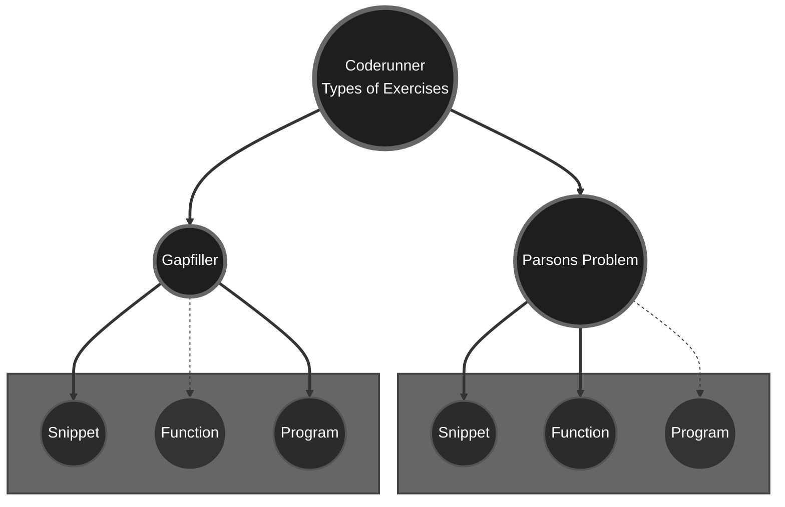

# Coderunner-C-Prototypes
Specialized prototypes, examples, and documentation for custom C programming tasks in the Moodle Coderunner plugin.

```mermaid
flowchart TD
    %% Main Node
    Coderunner((Coderunner<br/>Types of Exercises))

    %% Subcategories
    ParsonsProblem((Parsons Problem))
    Gapfiller((Gapfiller))

    %% Parsons Problem Nodes
    subgraph ParsonsProblemGroup [ ]
        Snippet1((Snippet))
        Function1((Function))
        Programm1((Program))
    end

    %% Gapfiller Nodes
    subgraph GapfillerGroup [ ]
        Snippet2((Snippet))
        Function2((Function))
        Programm2((Program))
    end

    %% Hierarchical structure
    Coderunner --> ParsonsProblem
    Coderunner --> Gapfiller

    ParsonsProblem --> Snippet1
    ParsonsProblem --> Function1
    ParsonsProblem -.-> Programm1

    Gapfiller --> Snippet2
    Gapfiller -.-> Function2
    Gapfiller --> Programm2

    %% Styles for Main Nodes
    style Coderunner stroke-width:5px,fill:#1e1e1e,stroke:#666,color:#ffffff
    style ParsonsProblem stroke-width:4px,fill:#1e1e1e,stroke:#666,color:#ffffff
    style Gapfiller stroke-width:4px,fill:#1e1e1e,stroke:#666,color:#ffffff

    %% Styles for Exercise Nodes
    style Snippet1 stroke-width:2px,fill:#2b2b2b,stroke:#555,color:#ffffff
    style Function1 stroke-width:2px,fill:#2b2b2b,stroke:#555,color:#ffffff
    style Programm1 stroke-width:2px,fill:#2b2b2b,stroke:#555,color:#ffffff

    style Snippet2 stroke-width:2px,fill:#2b2b2b,stroke:#555,color:#ffffff
    style Function2 stroke-width:2px,fill:#2b2b2b,stroke:#555,color:#ffffff
    style Programm2 stroke-width:2px,fill:#2b2b2b,stroke:#555,color:#ffffff

    %% Styles for faded/dashed nodes
    style Programm1 fill:#333,stroke:#666,color:#ffffff
    style Function2 fill:#333,stroke:#666,color:#ffffff

    %% Link Styles
    linkStyle 0 stroke-width:3px
    linkStyle 1 stroke-width:3px
    linkStyle 2 stroke-width:3px
    linkStyle 3 stroke-width:3px
    linkStyle 4 stroke-width:1px,stroke-dasharray: 3,3
    linkStyle 5 stroke-width:3px
    linkStyle 6 stroke-width:1px,stroke-dasharray: 3,3
    linkStyle 7 stroke-width:3px

    %% Subgraph styles (optional background for groups)
    classDef ParsonsProblemGroupStyle fill:#666,stroke:#444,stroke-width:2px;
    classDef GapfillerGroupStyle fill:#666,stroke:#444,stroke-width:2px;
    class ParsonsProblemGroup ParsonsProblemGroupStyle;
    class GapfillerGroup GapfillerGroupStyle;

```
